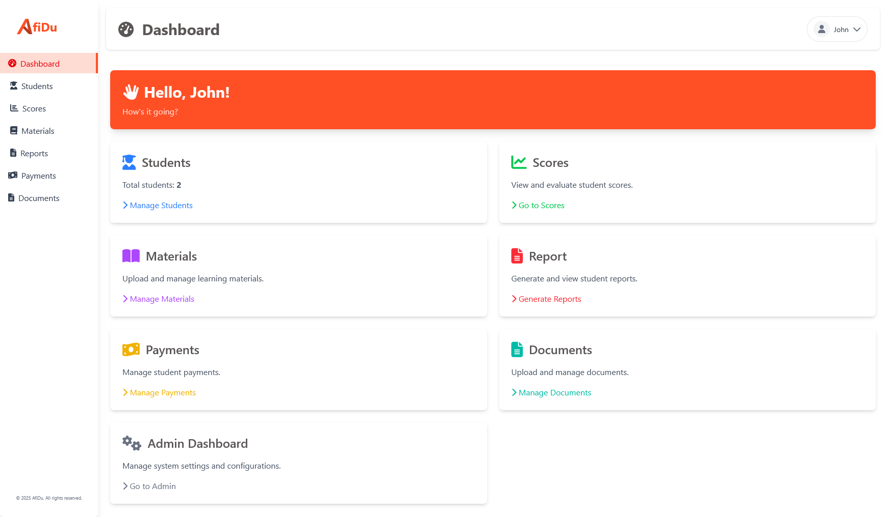

# AfiDu - sistem pengelolaan data murid bimbel bahasa inggris

<p align="center">
  
</p>

## 📋 overview

AfiDu adalah sistem pengelolaan data murid yang didesain untuk bimbel bahasa inggris. app ini menyederhanakan manajemen murid, pelacakan nilai, pemrosesan pembayaran, dan pengorganisasian materi belajar untuk sebuah bimbel bahasa inggris.

## ✨ fitur fitur

### 👨‍🎓 manajemen murid

- tambah, edit, dan hapus data murid
- masukkan murid ke level atau kelas tertentu
- konfigurasi kelas dan level
- opsi filter lanjutan untuk pencarian murid yang cepat

### 📊 pelacakan nilai

- catat nilai murid berdasarkan tahun, semester, dan kategori
- konfigurasi sistem penilaian unik sesuai kebutuhanmu
- sesuaikan formula untuk menghitung nilai akhir
- perhitungan nilai secara real-time
- opsi filter untuk akses data yang mudah

### 📚 materi belajar

- upload materi belajar dalam format pdf
- lihat dan edit nama dan kategori materi
- filter materi berdasarkan kategori
- fitur preview dokumen

### 📝 laporan

- buat laporan nilai individual murid
- ekspor semua laporan sebagai zip berdasarkan filter yang diterapkan
- pelaporan nilai komprehensif dari sistem pelacakan nilai

### 💰 manajemen pembayaran

- konfigurasi biaya bulanan
- atur periode pembayaran tengah semester dan akhir semester
- ringkasan pembayaran detail yang menampilkan:
  - total jumlah yang harus dibayar
  - total jumlah yang sudah dibayar
  - sisa jumlah yang harus dibayar
  - status pembayaran bulanan
- konfigurasi pengaturan pembayaran berdasarkan tahun
- cicil pembayaran dalam beberapa transaksi

### 📝 laporan

- buat laporan nilai individual murid
- ekspor semua laporan sebagai zip berdasarkan filter yang diterapkan
- pelaporan nilai komprehensif dari sistem pelacakan nilai
- unduh berbagai jenis dokumen:
  - formulir pendaftaran murid
  - kartu pembayaran murid
  - daftar murid yang dapat dikonfigurasi (PDF/Excel)
  - laporan pembayaran detail dengan opsi filter
  - ringkasan komprehensif murid dengan informasi akademik dan pembayaran

### 👥 user roles

- **teacher**: akses ke aplikasi
- **superuser**: akses penuh termasuk halaman admin dan bisa membuat akun baru

## 🛠️ teknologi yang digunakan

- **framework**: django
- **frontend**:
  - tailwind - utility first css framework
  - fontawesome - library icon
- **database**: postgresql (berbasis cloud/lokal)/sqlite (opsional)
- **email**: backend email custom untuk link reset password (dioptimalkan penggunaan secara lokal)

## 🖼️ ui



## 🎬 demo

<sub><sup>video demo otw<sub><sup>

## ⚙️ instalasi & setup

### prasyarat

1.  python 3.8+
2.  node.js dan npm
3.  poppler (untuk membuat thumbnail materi belajar)
4.  git

### menginstal poppler

#### windows

```bash
# menggunakan chocolatey
choco install poppler

# atau download build terbaru dari: https://github.com/oschwartz10612/poppler-windows/releases
# tambahkan direktori bin ke variabel lingkungan path
```

#### macos

```bash
# menggunakan homebrew
brew install poppler
```

#### linux(ubuntu/debian)

```bash
sudo apt update
sudo apt install poppler-utils
```

### menyiapkan project

1.  **clone repository**

```bash
git clone https://github.com/rywndr/afidu.git
cd afidu
```

2. **buat dan aktifkan virtual environment**

```bash
python -m venv .venv

# untuk windows
.venv\Scripts\activate

# untuk macos/linux
source .venv/bin/activate
```

3. **install python requirements**

```bash
pip install -r requirements.txt
```

4. **install node.js dependency**

```bash
npm install
```

5. **siapkan environment variables**

```bash
# salin .env.example ke .env

cp .env.example .env

# edit file .env dengan kredensial database dan pengaturan lainnya
```

6. **migrasi database**

```bash
python manage.py migrate
```

7. **buat superuser**

```bash
python manage.py createsuperuser
```

### run app

menjalankan server django dan compiler tailwind css di terminal window terpisah

### terminal 1 - jalankan compiler tailwind css

```bash
npx tailwindcss -i ./static/src/input.css -o ./static/src/output.css --watch
```

### terminal 2 - jalankan server django

```bash
python manage.py runserver
```

kemudian kunjungi http://127.0.0.1:8000 di browser untuk akses app.

## 🎨 color palette

| color   | hex code  | preview                                                                               |
| ------- | --------- | ------------------------------------------------------------------------------------- |
| primary | `#ff4f25` |  |
| shade1  | `#cc3f1e` |  |
| shade2  | `#b3371a` |  |
| grey    | `#5a5656` |  |

## 📄 license

[mit license](./LICENSE)

## 👨‍💻 contributors

- [sudo](https://github.com/rywndr)
- [mizu](https://github.com/Miizzuuu)
